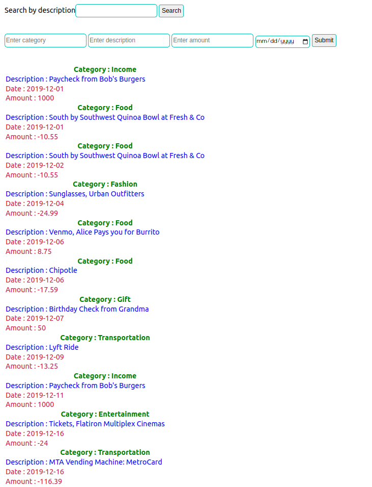

# bank-of-flatiron

## Run locally
first start by making a copy of the project on your GitHub account by forking and clone it to the local computer to be able to access the project.
After making a fork to your Github account click on the 'CODE' button and copy the SSH key then


Go to the terminal and to the directory where the copy exist on the local machine.


```bash
  git clone git@github.com:examplename/bank-of-flatiron.git
```


```bash
  cd bank-of-flatiron
```

open folder in text editor 

```bash
  code .
```


### `npm install`

    Run npm install to install the expected packages.
    After that run the following comands on the terminal to keep the react app running

### `npm start`

Runs the app in the development mode.\
Open [http://localhost:8001](http://localhost:8001) to view it in your browser.

The page will reload when you make changes.\
You may also see any lint errors in the console.

### `npm test`

Launches the test runner in the interactive watch mode.\
See the section about [running tests](https://facebook.github.io/create-react-app/docs/running-tests) for more information.

### `npm run build`

Builds the app for production to the `build` folder.\
It correctly bundles React in production mode and optimizes the build for the best performance.

The build is minified and the filenames include the hashes.\
Your app is ready to be deployed!

See the section about [deployment](https://facebook.github.io/create-react-app/docs/deployment) for more information.

### `npm run eject`

**Note: this is a one-way operation. Once you `eject`, you can't go back!**

If you aren't satisfied with the build tool and configuration choices, you can `eject` at any time. This command will remove the single build dependency from your project.

Instead, it will copy all the configuration files and the transitive dependencies (webpack, Babel, ESLint, etc) right into your project so you have full control over them. All of the commands except `eject` will still work, but they will point to the copied scripts so you can tweak them. At this point you're on your own.

You don't have to ever use `eject`. The curated feature set is suitable for small and middle deployments, and you shouldn't feel obligated to use this feature. However we understand that this tool wouldn't be useful if you couldn't customize it when you are ready for it.


### Author 

 * [irungudennis](https://github.com/irungudenningang)

 ## How the project works

    This project is based on react :
    * As a user i can see a list of alll my transaction.
    * As a user i can add a transaction.
    * As a user i can filter the list of transaction using a search input.
    
   

## 🚀 About Me
 * I'm a full stack developer
 * find me [here](https://github.com/irungudenninganga)


## License 
MIT License

Copyright (c) 2023 irungudennisnganga

>Permission is hereby granted, free of charge, to any person obtaining a copy
of this software and associated documentation files (the "Software"), to deal
in the Software without restriction, including without limitation the rights
to use, copy, modify, merge, publish, distribute, sublicense, and/or sell
copies of the Software, and to permit persons to whom the Software is
furnished to do so, subject to the following conditions:

>The above copyright notice and this permission notice shall be included in all
copies or substantial portions of the Software.

>THE SOFTWARE IS PROVIDED "AS IS", WITHOUT WARRANTY OF ANY KIND, EXPRESS OR
IMPLIED, INCLUDING BUT NOT LIMITED TO THE WARRANTIES OF MERCHANTABILITY,
FITNESS FOR A PARTICULAR PURPOSE AND NONINFRINGEMENT. IN NO EVENT SHALL THE
AUTHORS OR COPYRIGHT HOLDERS BE LIABLE FOR ANY CLAIM, DAMAGES OR OTHER
LIABILITY, WHETHER IN AN ACTION OF CONTRACT, TORT OR OTHERWISE, ARISING FROM,
OUT OF OR IN CONNECTION WITH THE SOFTWARE OR THE USE OR OTHER DEALINGS IN THE
SOFTWARE.  

